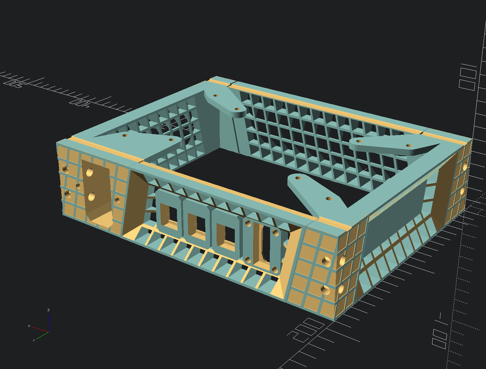
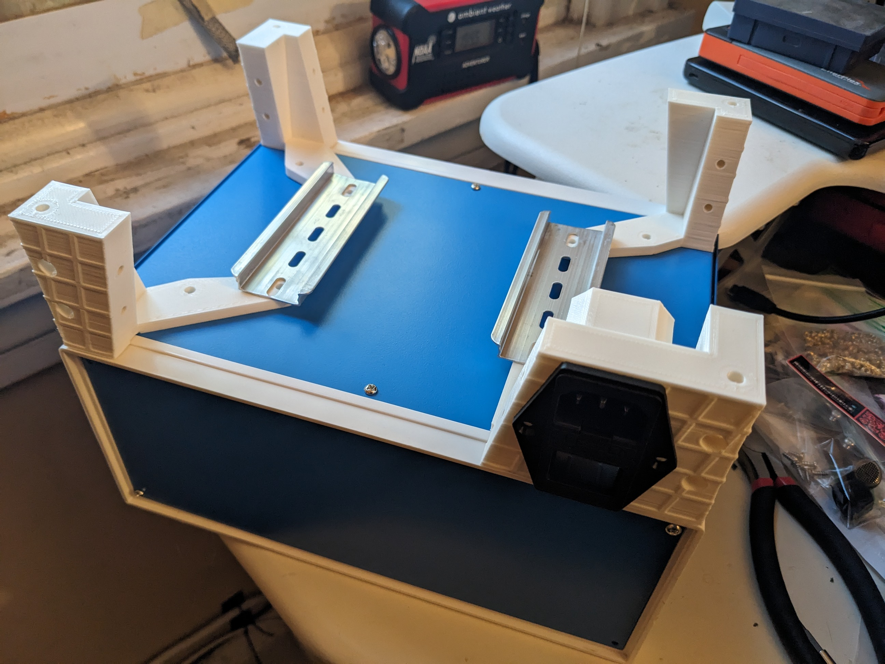
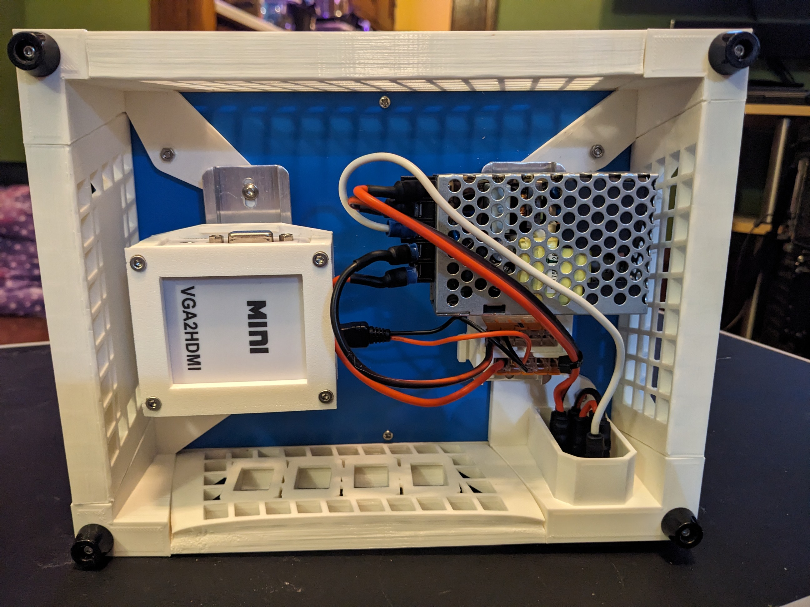
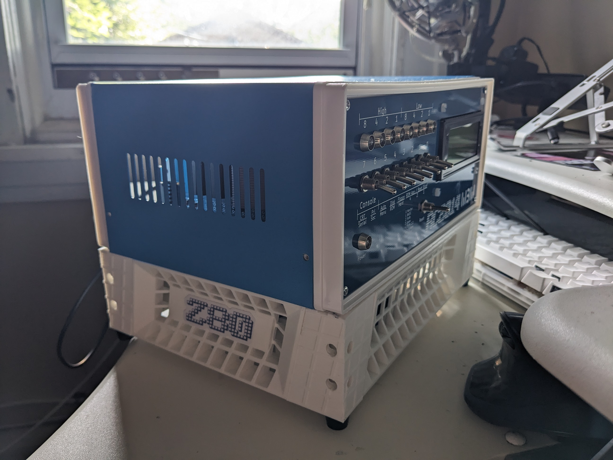

# Power Base for the RC2014

The [rc2014](https://rc2014.co.uk/) is a retro styled z80 computer you build as a kit. Combined with the [Front Panel Kit](https://z80kits.com/shop/blue-box-front-panel-switch-and-led-for-romwbw/), you have a handsome machine!

But...wouldn't it be *better* if you could also have a little more room? Enough for a power supply, an HDMI adapter, or anything you can mount on a DIN rail?

Look no further!

## Features

* Dual DIN rails to mount accessories
* Three keystones for added ports
* One IEC power inlet
* One VGA gender changer mountpoint for VGA passthrough
* Threaded inserts for easy assembly and disassembly
* Lots of venting
* rc2014 styling
* Sticker panel!

## Design and motive

Check out the [blog post](https://deninet.com/blog/2024/09/08/printable-expansion-box-rc2014).

## Printing

Print each part in any rigid filament such as PETG, PLA, or ABS. White works wellwith the recommended enclosure!

## Assembly

1. Print all parts, adding threaded inserts where needed.
2. Remove the existing feet from the enclosure.
3. Bolt through the enclosure's existing holes to mount the printed columns.
4. Position the panels, bolting through the columns to secure them.
5. Install the IEC inlet.
6. Install keystones as desired.
7. Install VGA gender changer in the rear-panel pocket, screw down the cover.
8. Install the new feet on the bottom of the columns.

## Gallery

